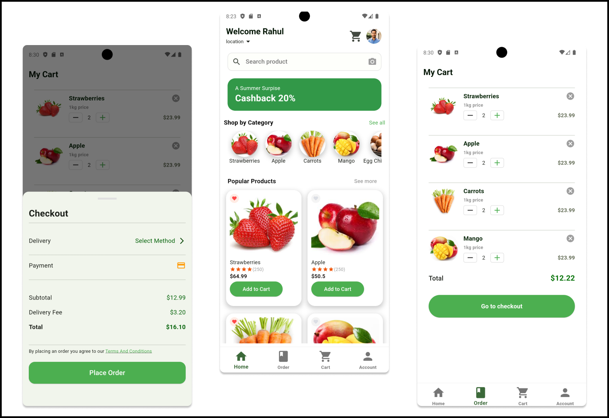

# Foody 🍽️

**Foody** is a sleek and modern food ordering system UI, designed to provide users with a seamless and delightful experience when ordering food from the comfort of their homes. Built with **Flutter** and **Dart**, Foody combines beautiful design with user-friendly functionality, making it easy and enjoyable to browse menus, select meals, and place orders.

## Screenshot 📸



## Features ✨

- **Simple and Clean Design**: A beautiful, minimalist interface that ensures smooth navigation.
- **Easy Food Browsing**: Browse through food categories and restaurants effortlessly.
- **Responsive UI**: Optimized for all screen sizes, from mobile to tablet.
- **Fast and Lightweight**: Built with performance in mind to ensure a lag-free experience.

## Tech Stack 🔧

- **Flutter**: For cross-platform, high-performance mobile app development.
- **Dart**: The powerful language behind Flutter, ensuring fast and reliable functionality.


## How to Run 🛠️

1. Clone the repository:
   ```
   git clone https://github.com/DeepeshKalura/foody.git
   ```
2. Navigate to the project directory:
   ```
   cd foody
   ```
3. Install dependencies:
   ```
   flutter pub get
   ```
4. Run the app:
   ```
   flutter run
   ```

Enjoy the comfort of ordering your favorite meals with **Foody**! 🚀

---

Feel free to contribute, and don't forget to star ⭐ the repository if you like the project! 😊